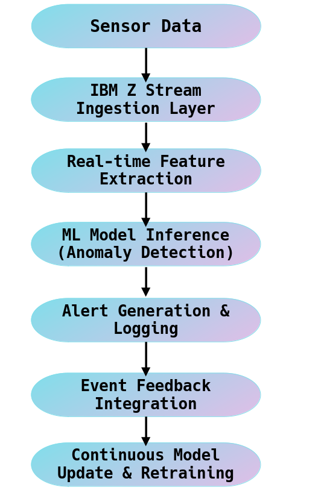

# ML model to detect water theft through illegal taps on water pipelines underground using real-time sensor readings

### Could someone really steal water??

**YES!**

Illegal taps are commonly found in urban areas with high water demand and limited supply, such as residential neighbourhoods, commercial zones, and industrial areas.

Illegal taps on water pipelines are typically made by individuals or groups trying to steal water without paying for it. These illegal activities are done by people ranging from residents and small business seeking free water to organized criminal groups involved in large-scale water theft.
They use tapping techniques like drilling or hot tapping, sometimes covertly underground, posing major challenges for water management and safety.

The ***MOTIVATIONS*** often include avoiding water bills, supplying water to unauthorized users, or illicit resale.

Water theft through illegal pipeline taps results in significant resource loss and damages infrastructure while depriving communities of fair access to water. 

### Can we do something about it??

**YES! WE CAN USE AI TO DETECT IT**

Conventional detection methods are slow, labor-intensive, and often ineffective against concealed or sophisticated illegal taps.  

We develop an effective, data-driven solution using sensor technologies (pressure, flow, leak, vibration) to detect illicit tapping events in real-time, conserve water, and ensure equitable distribution—leveraging technology for societal good.

We use monitoring system that analyzes real-time data from a network of pressure, flow, and leak detection sensors installed throughout the water distribution network. Using machine learning and anomaly detection algorithms, the system identifies irregular patterns indicating possible illegal taps. Alerts are generated instantly for suspected cases, enabling field teams to act quickly.

## About our Dataset

The simulated dataset is not derived from real field data but was designed to mimic realistic pipeline sensor behavior for model prototyping and validation.

Our dataset emulates real-world pipeline sensor readings under diverse operating conditions. It was designed to closely resemble actual patterns of **pressure**, **flow rate**, and **leak variations**, enabling **controlled experimentation** and **realistic yet reproducible** model evaluation.

## About the Model

Machine learning models  **XGBoost**, and **anomaly detection algorithms** were trained and evaluated to classify events and flag potential illegal tapping.

**Evaluation Metrics:**
- Precision, Recall, and F1-score  
- Confusion Matrix Analysis  
- Time-aware Train/Test Split  
- Handling class imbalance with weighted losses and oversampling 

# How our solution leverages IBM Z
Model training and experimentation were executed on an **IBM Z server environment provided by IBM**, accessed securely via **SSH**

The high-performance infrastructure enabled:
- Faster feature engineering and preprocessing
- Efficient handling of large-scale simulated datasets
- Accelerated model training cycles and experimentation

In a real-world deployment, water distribution systems generate **massive, continuous streams of sensor data** from hundreds or thousands of monitoring nodes distributed across large geographic regions. It could even reach millions to billions! Each node transmits high-frequency readings of **pressure, flow rate, leak intensity, and vibration** — data that must be processed, analyzed, and acted upon with **minimal latency**.

The **IBM Z server architecture** is particularly suited for this type of **mission-critical, high-volume data processing** due to its combination of **scalability, reliability, and real-time analytics capabilities**.

### How IBM Z Servers Enhance Real-Time Detection

IBM Z systems can handle thousands of concurrent data streams and transactions, ensuring that every sensor reading , even from remote pipeline sections , is processed instantly without delays or data loss known as **Massive Parallel Processing (MPP)**.
  
The system can ingest data at **millisecond-level latency**, making it ideal for real-time anomaly detection where immediate alerts are crucial to prevent further water loss. IBM Z servers are known for their **Low-Latency Data Streaming**.
**Continuous Model Retraining**  can be easily done.
As new data flows in, IBM Z’s computational power allows **incremental learning** or **scheduled retraining** of models.  
ensures the detection algorithm evolves over time, adapting to:
- Seasonal water usage patterns
 - Pressure fluctuations
- Long-term pipeline aging effects
Such retraining would be computationally intensive on standard infrastructure but can be handled seamlessly on IBM Z

**Hybrid Cloud Integration**  
IBM Z integrates with modern data frameworks (Apache Kafka, Spark, TensorFlow, PyTorch) and can connect to **hybrid cloud architectures**, allowing model components to run collaboratively across on-premise and cloud environments.

**Security and Reliability:**  
Given that water infrastructure is a **critical national asset**, IBM Z provides enterprise-grade **encryption, access control, and resiliency** — ensuring continuous uptime and protection from tampering or data breaches.

### Explanation of the flowchart:

1. **Sensor Data:** Water pipelines have sensors that measure things like pressure, flow rate, and leak intensity. These sensors constantly send readings (data) every few seconds or minutes.

2. **IBM Z Stream Ingestion Layer:** This is the entry point for all that sensor data. The IBM Z server collects data in real time — like a super-fast data receiver. It can handle huge volumes of data without lag or crashing.

3. **Real-time Feature Extraction:** Once the data is received, the system quickly calculates useful metrics (called features) such as:
- sudden drops in pressure
- abnormal flow changes
- patterns over time

4. **ML Model Inference (Anomaly Detection):** The machine learning model analyzes these features and predicts if something looks suspicious — for example, it might flag that “pressure dropped too fast — possible illegal tap!”. This step happens in real time on the IBM Z machine, which can process thousands of readings per second.

5. **Alert Generation & Logging:** If the model detects an anomaly, it sends:
- an alert (to the control center or maintenance team), and
- a log entry (recording the event, timestamp, and sensor details).
This ensures the issue can be investigated quickly.

6. Event Feedback Integration: After investigation, teams confirm what actually happened — e.g., whether it was a confirmed theft, a leak, or a false alarm. This feedback is sent back into the system as new labeled data.

7. Continuous Model Update & Retraining: The model uses this new feedback to learn and improve. As more real cases are detected (thefts, leaks, etc.), the model becomes smarter and more accurate over time — adapting to new patterns and conditions.
